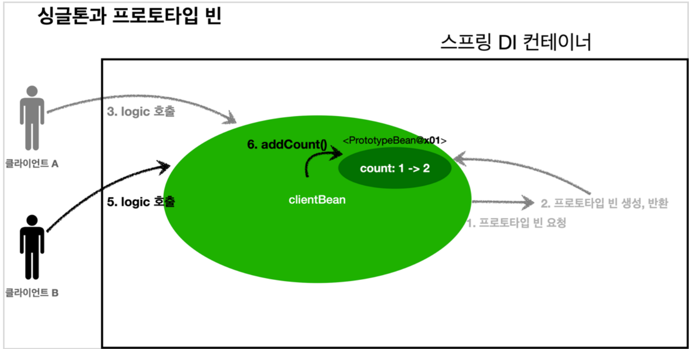

빈 스코프
========

## 싱글톤 스코프
* `@Scope("singleton")`으로 스코프의 기본값이다.
* 스프링 컨테이너와 생명주기가 거의 같다.
* 스프링 컨테이너가 관리한다.

## 프로토타입 스코프
* `@Scope("prototype")`으로 스코프를 지정 가능하다.
* 스프링 컨테이너에 요청할 때 초기화를 하고 매 요청시 새로운 객체가 생성된다.
* 스프링 컨테이너는 빈의 생성과 의존관계 주입, 초기화까지만 관리하며 이후는 전혀 관리하지 않는다.
    * 그래서 예를 들어 빈 종료 메서드는 호출 되지 않는다.
    * 즉, 프로토타입 빈은 해당 빈을 조회한 클라이언트가 관리해야한다.
  
## 싱글톤에서 프로토타입 스코프를 함께 사용
### 문제
싱글톤 빈이 생성 후 프로토타입 빈을 주입받으면 **요청 할 때 마다 프로토타입빈을 생성**    
기능이 의도대로 작동하지 않는다.
  
  > 하나의 프로토타입 스코프의 빈을 계속 재사용하는 것이다.
  

### 해결
지정한 프로토타입 빈을 컨테이너에서 대신 찾아주는     
Dependency Lookup 기능의 무언가가 필요하다.  
* `ObjectProvider` 를 사용하여 해결가능하다.
  * 그러나 `org.springframework.beans.factory.ObjectProvider` 이라 스프링에 의존적이다.
* 혹은 자바 표준 `JSR-330 Provider`를 사용하여 해결 가능하다.
  * `javax.inject:javax.inject:1` 을 그레이들에 추가해 사용가능하다

[SingletonWithPrototype](Core1-SPRING/src/test/java/hello/core2/scope/SingletonWithPrototype1.java)
