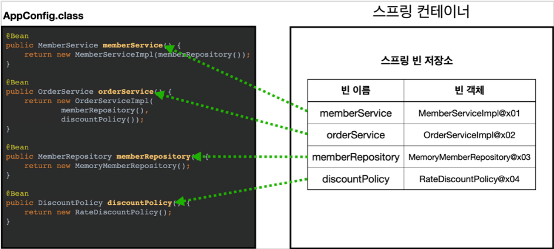
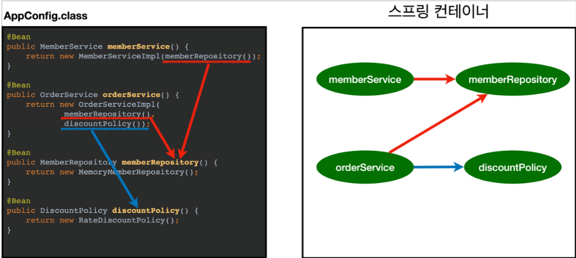

스프링 컨테이너와 빈
================

* `ApplicationContext`를 스프링 컨테이너라 하며 이것은 인터페이스이다.
    * 스프링 컨테이너는 `xml`기반, `Annotation`기반으로 구체화할 수 있다.
    
* 스프링 컨테이너를 생성할 때는 `구성정보(AppConfig)`를 지정해줘야 한다.
    * `new AnnotationConfigApplicationContext(AppConfig.class)`    
  
      위 코드를 실행 후 결과적으로 아래의 그림이 된다.
      

* 이후 설정 정보를 참조해서 동적 의존 관계를 주입한다.

  > 단순히 설정 정보대로 코드를 호출하는 듯이 보이지만 차이가있다.   
  > 싱글톤 요약을 참고