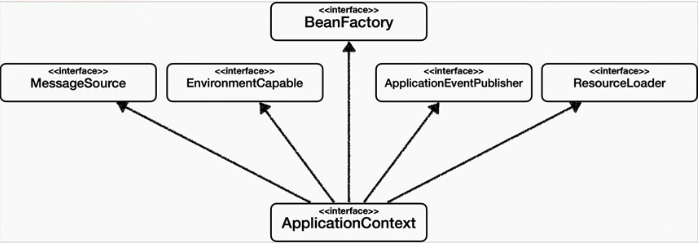

BeanFactory와 ApplicationContext
================================

## 계층구조
  

* 국제화 기능, 운영 구분 처리, 발행-구독 모델 지원, 리소스 조회 기능이   
ApplicationContext에서 제공하는 부가기능이다.
  
* BeanFactory를 직접 사용 할 일은 거의없고,   
  부가기능이 포함된ApplicationContext를 사용한다.
  
* 일반적으로 BeanFactory나 ApplicationContext를 스프링 컨테이너라 한다.
